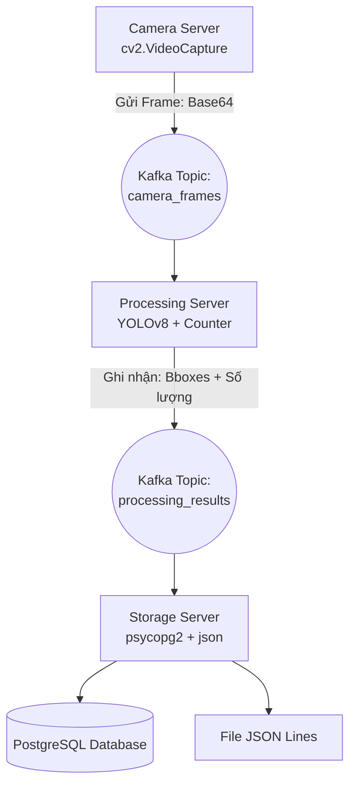
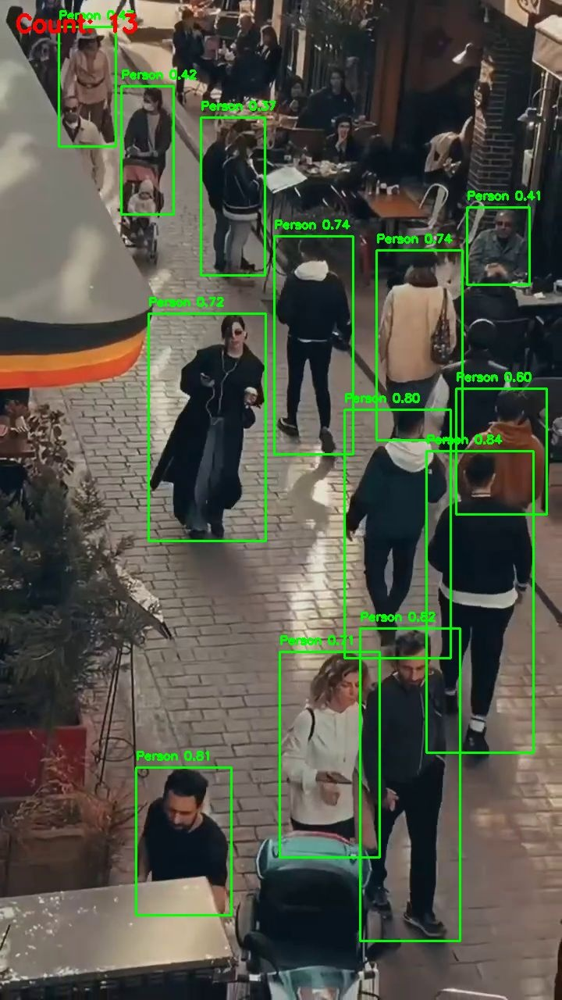
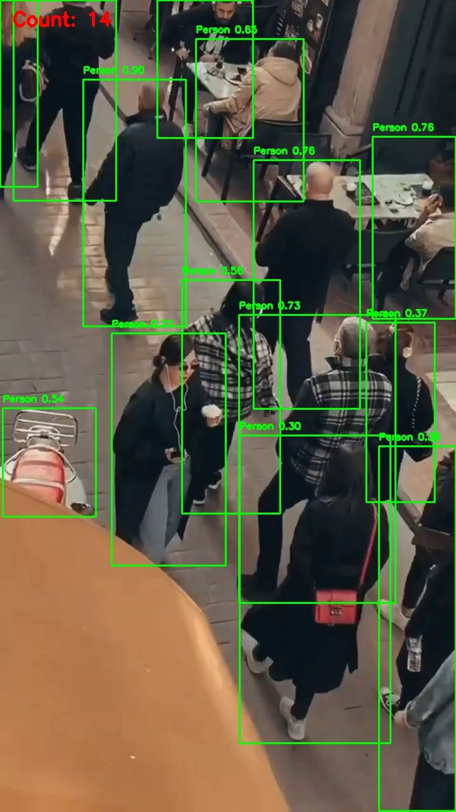

# XÂY DỰNG HỆ THỐNG ĐẾM NGƯỜI VỚI BIG DATA

---

Bài tập này tập trung giải quyết bài toán phát hiện và đếm số lượng người thông qua nguồn cấp dữ liệu từ camera trực tiếp. Điểm đặc biệt của bài tập là việc áp dụng các công nghệ trong bối cảnh Dữ liệu lớn (Big Data) để đảm bảo hệ thống có khả năng xử lý liên tục, phân tán và chịu tải cao.
-------------------------------------------------------------------------------------------------------------------------------------------------------------------------------------------------------------------------------------------------------------------------------------------------------------------------------------------------------------------

## I. KIẾN TRÚC HỆ THỐNG (DATA PIPELINE)

Hệ thống được chia thành các dịch vụ độc lập, giao tiếp bất đồng bộ qua hệ thống Message Broker là **Apache Kafka**.



1. **Nút Camera (Nguồn phát liệu - Producer):** Đảm nhiệm việc thu thập khung hình từ webcam, thực hiện nén dữ liệu để giảm băng thông và đẩy liên tục vào topic `camera_frames`.
2. **Nút Xử Lý (Trí tuệ nhân tạo & Khai phá dữ liệu):**
   - Đọc luồng dữ liệu từ Kafka.
   - Sử dụng mô hình Deep Learning `YOLOv8` để nhận diện phân lớp "người".
   - Kích hoạt module đếm độc lập để tính toán số lượng.
   - Đóng gói tọa độ khu vực nhận diện (Bounding Box) và tổng số người để phát lên topic `processing_results`.
3. **Nút Lưu Trữ (Đích đến - Consumer):** Tiếp nhận thông tin đã qua xử lý từ Kafka và thực thi việc bóc tách. Dữ liệu sau đó sẽ được lưu song song vào cơ sở dữ liệu **PostgreSQL** để truy vấn mạnh mẽ, đồng thời ghi log dự phòng dưới định dạng file `JSON Lines`.

---

## II. YÊU CẦU MÔI TRƯỜNG & CÀI ĐẶT

Để vận hành dự án trên máy cá nhân, hệ thống yêu cầu:

- **Docker Desktop**: Chạy Kafka, Zookeeper và **PostgreSQL** Database.
- **Python (>=3.8)**: Chạy mã nguồn logic.

**Quy trình chuẩn bị:**

1. Mở Terminal tại thư mục chứa dự án.
2. Triển khai hạ tầng Kafka Broker bằng lệnh:
   ```cmd
   docker-compose up -d
   ```
3. Cài đặt các gói phụ thuộc (Dependencies) cho Python:
   ```cmd
   pip install -r requirements.txt
   ```

---

## III. HƯỚNG DẪN CHẠY 

Hệ thống yêu cầu chạy song song 3 phiên làm việc (Terminal/Command Prompt) khác nhau.

**1: Kích hoạt Hệ thống Lưu Trữ**

```cmd
python -m src.storage.storage_app
```

**2: Kích hoạt Hệ thống AI Xử lý**

```cmd
python -m src.processor.processor_app
```

**3: Bật Kết nối Nguồn Ảnh/Camera**
Bây giờ hệ thống hỗ trợ cả camera trực tiếp và luồng ảnh tĩnh. Có thể chọn cách chạy thông qua parser `--source`.

- **Dùng Webcam trực tiếp:**

  ```cmd
  python -m src.camera.camera_app --source 0
  ```
- **Dùng file ảnh tĩnh (ví dụ `test.jpg`):**

  ```cmd
  python -m src.camera.camera_app --source test.jpg
  ```

  ```cmd
  python -m src.camera.camera_app --source video.mp4
  ```

---

## IV. OUTPUT

Sau khi hệ thống phân tích hình ảnh và video, kết quả sẽ được lưu vào cơ sở dữ liệu và file log `results.jsonl`. Các khung hình có vẽ khung bounding box sẽ được xuất vào thư mục `storage_data/output_images/`.

### 1. Kết quả từ dữ liệu Ảnh tĩnh

Dưới đây là hình ảnh kết quả nhận diện từ đầu vào là file ảnh tĩnh. Hệ thống đã vẽ khung nhận diện (bounding box) và đếm được số lượng người tương ứng:


### 2. Kết quả từ luồng dữ liệu Video

Quá trình xử lý video được hệ thống bóc tách, trích xuất từng khung hình theo luồng (stream) và phân tích. Dưới đây là 2 khung hình mẫu được cắt từ đoạn đầu và cuối của video:

- **Khung hình đoạn đầu (Frame 1):**
  
- **Khung hình đoạn cuối (Frame 17):**
  

### 3. Cấu trúc log dữ liệu JSON (Big Data Log)

Song song với việc lưu trữ vào hệ quản trị cơ sở dữ liệu **PostgreSQL**, luồng dữ liệu thô cũng được ghi dự phòng vào file `storage_data/results.jsonl`. Định dạng chuẩn mỗi log entry sẽ được cấu trúc giống như sau:

```json
{
  "frame_id": 0,
  "timestamp": 1782059875.0038335,
  "people_count": 7,
  "bounding_boxes": [
    {
      "x1": 266.8806457519531,
      "y1": 891.7628784179688,
      "x2": 331.48651123046875,
      "y2": 1082.67138671875,
      "confidence": 0.8100543022155762
    },
    "... (các tọa độ bounding box khác)"
  ]
}
```
