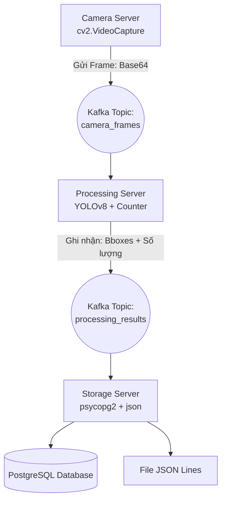

# XÂY DỰNG HỆ THỐNG ĐẾM NGƯỜI VỚI BIG DATA

---
Dự án này tập trung giải quyết bài toán phát hiện và đếm số lượng người thông qua nguồn cấp dữ liệu từ camera trực tiếp. Điểm đặc biệt của dự án là việc áp dụng các công nghệ thuộc lĩnh vực Dữ liệu lớn (Big Data) để đảm bảo hệ thống có khả năng xử lý liên tục, phân tán và chịu tải cao.
---

## II. KIẾN TRÚC HỆ THỐNG (DATA PIPELINE)
Hệ thống được chia thành các dịch vụ độc lập, giao tiếp bất đồng bộ qua hệ thống Message Broker là **Apache Kafka**.



1. **Nút Camera (Nguồn phát liệu - Producer):** Đảm nhiệm việc thu thập khung hình từ webcam, thực hiện nén dữ liệu để giảm băng thông và đẩy liên tục vào topic `camera_frames`.
2. **Nút Xử Lý (Trí tuệ nhân tạo & Khai phá dữ liệu):**
   - Đọc luồng dữ liệu từ Kafka.
   - Sử dụng mô hình Deep Learning `YOLOv8` để nhận diện phân lớp "người".
   - Kích hoạt module đếm độc lập để tính toán số lượng.
   - Đóng gói tọa độ khu vực nhận diện (Bounding Box) và tổng số người để phát lên topic `processing_results`.
3. **Nút Lưu Trữ (Đích đến - Consumer):** Tiếp nhận thông tin đã qua xử lý từ Kafka và thực thi việc bóc tách. Dữ liệu sau đó sẽ được lưu song song vào cơ sở dữ liệu **PostgreSQL** để truy vấn mạnh mẽ, đồng thời ghi log dự phòng dưới định dạng file `JSON Lines`.

---

## III. YÊU CẦU MÔI TRƯỜNG & CÀI ĐẶT
Để vận hành dự án trên máy cá nhân, hệ thống yêu cầu:
- **Docker Desktop**: Chạy Kafka, Zookeeper và **PostgreSQL** Database.
- **Python (>=3.8)**: Chạy mã nguồn logic.

**Quy trình chuẩn bị:**
1. Mở Terminal tại thư mục chứa dự án.
2. Triển khai hạ tầng Kafka Broker bằng lệnh:
   ```cmd
   docker-compose up -d
   ```
3. Cài đặt các gói phụ thuộc (Dependencies) cho Python:
   ```cmd
   pip install -r requirements.txt
   ```

---

## IV. HƯỚNG DẪN VẬN HÀNH (TESTING)
Hệ thống yêu cầu chạy song song 3 phiên làm việc (Terminal/Command Prompt) khác nhau. Lưu ý **cần đứng ở thư mục gốc của dự án** khi gõ lệnh.

**1: Kích hoạt Hệ thống Lưu Trữ**
```cmd
python -m src.storage.storage_app
```

**2: Kích hoạt Hệ thống AI Xử lý**
*(Việc tải trọng số YOLO có thể mất chút thời gian ở lần khởi chạy đầu tiên)*
```cmd
python -m src.processor.processor_app
```

**3: Bật Kết nối Camera**
```cmd
python -m src.camera.camera_app
```

---

## V. KẾT QUẢ ĐẠT ĐƯỢC (OUTPUT)
*(Hình ảnh minh họa hệ thống đang hoạt động và log dữ liệu sẽ được sinh viên dán vào đây trước khi nộp bài)*
